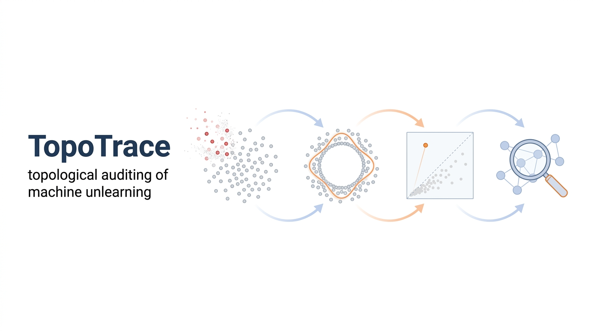

<p align="center">
  
</p>

<p align="center">
  <a href="LICENSE"></a>
  
  
  
</p>

**TopoTrace** audits machine unlearning *inside the representation space*.
After a deletion request, an unlearned model \(M_U\) is supposed to behave as
if it had been retrained from scratch without the forgotten data (\(M_R\)).
TopoTrace asks a stricter question than output metrics can:

> Does the multi-scale **topology** that the forgotten data induced in the
> model's internal representations become statistically indistinguishable
> from the topology of models that **never saw those data**?

It computes persistent-homology fingerprints of a fixed probe set at each
layer and tests the unlearned model against a **distribution of independently
retrained oracle models** — not a single reference run.

---

## Why topology?

Output-level audits can be satisfied while structure remains. In our
CIFAR-10 experiments, **SCRUB passes a loss-based membership-inference audit
(AUC 0.509 vs 0.508 for exact retraining) yet its representation topology is
flagged in every audited cell (permutation p ≈ 0.0003)** — and a simple
logistic regression on topology fingerprints separates SCRUB models from
exact retrains with **ROC-AUC ≈ 1.0**. Pointwise representation metrics
(cosine similarity) miss the same residuals entirely.

## Key ideas

| Component | What it does |
|---|---|
| **Oracle calibration** | The reference is a *distribution* of exact retrains (10+ seeds). Retrain–retrain variation \(D_{RR}\) defines the noise floor; a single-retrain reference can make even an exact retrain look like a no-op (TRR 0.17–1.92 depending on the seed you happen to pick). |
| **Topological Imprint Gate** | Residuals are only interpreted when the deletion itself produces a detectable imprint (\(D_{OR} > D_{RR}\); permutation test + bootstrap CI, BH-corrected). |
| **Topological Residual Ratio (TRR)** | Where a method sits between exact retraining (≈ 0) and no-op (≈ 1); values ≫ 1 flag destructive updates. |
| **Progress–Artifact decomposition (α, η)** | Separates movement *toward* the retrain oracle from changes retraining cannot explain — catches "fake" unlearning that merely perturbs weights. |
| **Topology-targeted deletion** | A benchmark deleting the samples that support persistent features, selected by an independent selector model, with a class-matched random control. |

## Findings at a glance

- **Detection scope.** The imprint is detectable exactly where representations
  are rich and the deletion is structured: strong on CIFAR-10/100 and
  SVHN-class (all audited cells, p ≤ 0.0004 at 10 seeds), H0-only on
  simpler datasets, absent on MNIST — and absent for structure the model
  never encoded (synthetic redundant-cluster / label-irrelevant controls).
- **Calibration holds.** Independent exact retrains are never distinguishable
  from the oracle (p > 0.24 everywhere); every approximate method tested
  (fine-tuning, NegGrad, SCRUB, SSD) is (p ≤ 0.0005).
- **Localization.** The residual lives in late layers only (layer4 →
  logits of ResNet-18); early features carry nothing.
- **Dose–response.** Detectable from 1% random deletion upward, growing
  with deletion size, strongest for class-level deletion.
- **Joint audit needed.** Moderate weight noise *fakes* a low TRR at intact
  utility; the artifact term η and utility metrics expose it.

## Repository layout

```
src/topotrace/
  synthetic.py  models.py  train.py     # synthetic benchmarks (ring, bridge, ...)
  mnist.py      cnn.py                  # MNIST / FashionMNIST pilot
  cifar.py      svhn.py     resnet.py   # CIFAR-10/100, SVHN main experiments
  unlearn.py                            # finetune / NegGrad / SCRUB / SSD / noise control
  targeted.py                           # topology-targeted deletion (selector model)
  topology.py   metrics.py  stats.py    # PH, TRR/α/η, permutation + bootstrap + BH
  attacks.py                            # loss-based membership inference
scripts/
  run_m1_suite.py                       # synthetic suite with ground-truth topology
  run_m4.py / run_exp.py                # dataset × scenario experiment runners
  analyze_m2.py                         # layer × homology sweep + statistics
  layer_profile.py                      # full 7-layer topological profile
  ablate.py / formal_stats.py           # sensitivity ablations, equivalence tests
  eval_mia.py / relearn.py              # conventional-metric comparisons
  distinguish.py                        # topology-based U-vs-R distinguisher
  make_figures.py / make_tables.py      # paper artifact generation
```

## Setup

```bash
conda create -n tda python=3.12
conda activate tda
pip install torch torchvision --index-url https://download.pytorch.org/whl/cu130
pip install numpy scipy scikit-learn matplotlib ripser persim gudhi
```

Datasets load from `data/` (torchvision layout, auto-download on first use).
To reuse an existing torchvision data directory, make `data/` a
symlink/junction to it — it is gitignored either way.

## Reproduce

```bash
# 1. Synthetic sanity check: TRR anchors (retrain ≈ 0, no-op ≈ 1)
python scripts/run_m1_suite.py

# 2. Main experiment: CIFAR-10, random 5% deletion, 10 seeds (GPU, ~3 h)
python scripts/run_m4.py random 10

# 3. Statistics: imprint gate, per-method permutation tests
python scripts/analyze_m2.py results/m4_random

# 4. Conventional-metric comparison + operational validation
python scripts/eval_mia.py results/m4_random
python scripts/distinguish.py results/m4_random
```

Every run records probe sample IDs, per-model embeddings, model
checkpoints, and metrics under `results/` for offline re-analysis —
figures and tables regenerate from cached artifacts without retraining.

## Scope and claims

TopoTrace is an **empirical falsification and auditing framework**: a
topological match to the oracle distribution is evidence consistent with
successful unlearning under the chosen probe, layer, and statistic — it is
not a certificate, and it does not replace certified unlearning.

## License

[MIT](LICENSE)
